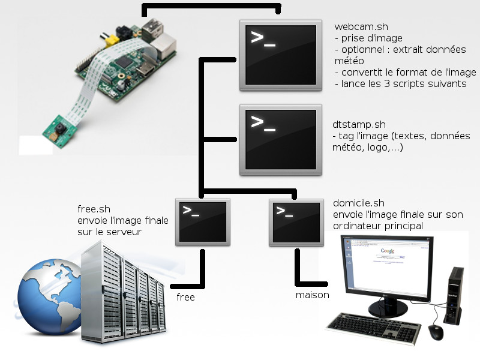

## Tuto/mémo - Publication d'une PiCam avec données météos locales à partir d'une RPI et de Weewx
###### Dernière modif tuto : 04/06/2016
**Ce tuto est largement inspiré de celui du site [Épinglé !](http://www.epingle.info/?p=3070), mais avec tout de même quelques ajouts.**

### 0 - Objectif
Le but est de pouvoir prendre une photo avec une PiCam sur une Raspberry Pi, pour ensuite lui ajouter quelques données de notre station météo, elle même gérée par Weewx sur la même Raspberry Pi, ou sur une autre.
<br>
Je vous invite d'abord à parcourir le tuto original [du site Épinglé !](http://www.epingle.info/?p=3070) afin de mieux comprendre. Si vous ne possédez pas de station météo perso, vous pouvez insérer les données d'une station METAR proche. Dans ce cas la, se référer au tuto précédemment cité.
<br>
Introduction de son tutoriel, et schéma l'illustrant :<br>
> Pour ce faire, nous allons utiliser tous les outils Raspbian pour mettre en œuvre la prise d'images régulière, le traitement de cette image et l'envoi sur un serveur distant. Schématiquement cela donne :
<br>


### 1 - Installation de paquets sur la RPI

Si vous avez une PiCam et une station météo perso, alors nous pouvons installer deux paquets :
```
	sudo apt-get update && sudo apt-get upgrade
	sudo apt-get install imagemagick ftp unzip
```

### 2 - Récupération des scripts


On va récupérer les scripts présents ici :

```
	cd /home/pi
	wget https://github.com/RaphaelChochon/RPI-PiCam/archive/master.zip
	unzip master.zip
```

Et on les déplace:
```
	cp -r RPI-PiCam-master/webcam/ /home/pi/webcam
```

Si tout va bien, on retrouve nos scripts dans le dossier ``/home/pi/webcam``

### 3 - Personnalisation des scripts

Dans ce dossier ``webcam`` on devrait retrouver plusieurs scripts shell :
* **webcam.sh** : C'est le script principal qui va appeler tous les autres !
* **data_copy.sh** ou **data_ftp.sh** : Il faudra choisir entre l'un des deux. Ces script font la même chose, c'est à dire qu'ils vont récupérer le fichier data.txt produit par Weewx, lui même alimenté par notre station météo perso. Si la station météo et Weewx sont sur la même RPI que celle qu'on est en train de configurer pour la PiCam, alors on utilisera le script ``data_copy.sh``. Sinon, on utilisera le script ``data_ftp.sh`` qui ira se connecter à notre serveur web pour récupérer le fichier ``data.txt``.
* **dtstamp.sh** : C'est le script qui va se servir du paquet ``imagemagick`` installé précédemment, afin de "tagué" l'image (texte, insertion du logo etc)
* **ftp.sh** : C'est le dernier ! Il va envoyer sur notre site web via FTP l'image produite.


#### 3.1 - webcam.sh

On commence par éditer celui ci. Et il n'y a pas grand chose à faire !
En fait on va simplement venir lui dire pour la récupération du fichier data.txt, quel script utiliser.
ça se passe entre la ligne 10 et 11, et on aura le choix entre deux propositions :

```
	#sudo ./data_copy.sh
	#sudo ./data_ftp.sh
```

Pour rappel on utilisera le script ``data_copy.sh`` si la station météo et Weewx sont sur la même RPI que celle qu'on est en train de configurer pour la PiCam.<br>
Sinon on utilisera le ``data_ftp.sh``.

Pour choisir entre les deux, on décommentera celui que l'on veut utiliser (le # devant une ligne, signifie que cette ligne est un commentaire ; Elle n'est donc pas pris en compte lors de l'éxécution du script). Par exemple si je veut utiliser ``data_copy.sh`` :

```
	sudo ./data_copy.sh
	#sudo ./data_ftp.sh
```
Et inversément :
```
	#sudo ./data_copy.sh
	sudo ./data_ftp.sh
```

En cours d'écriture ... :soon:

